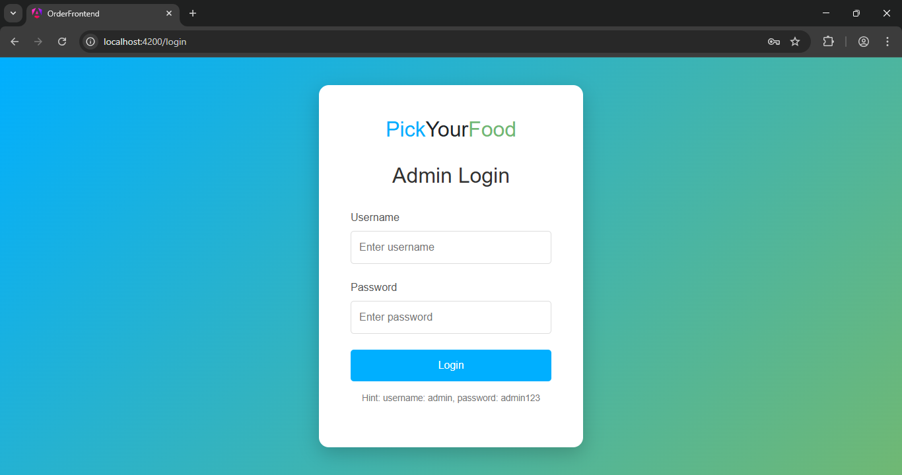
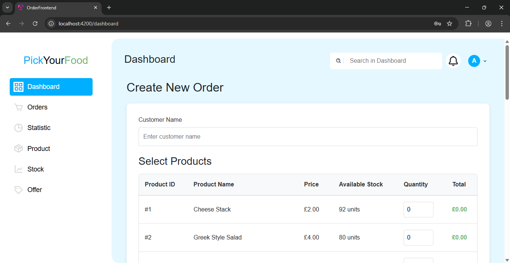
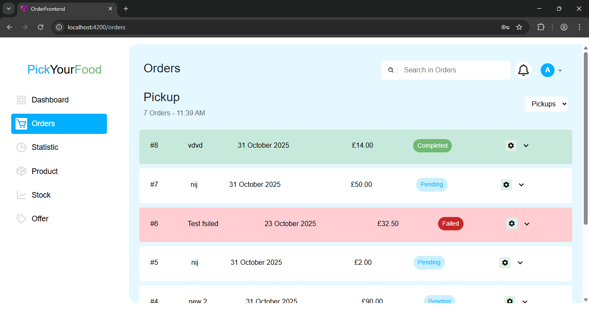
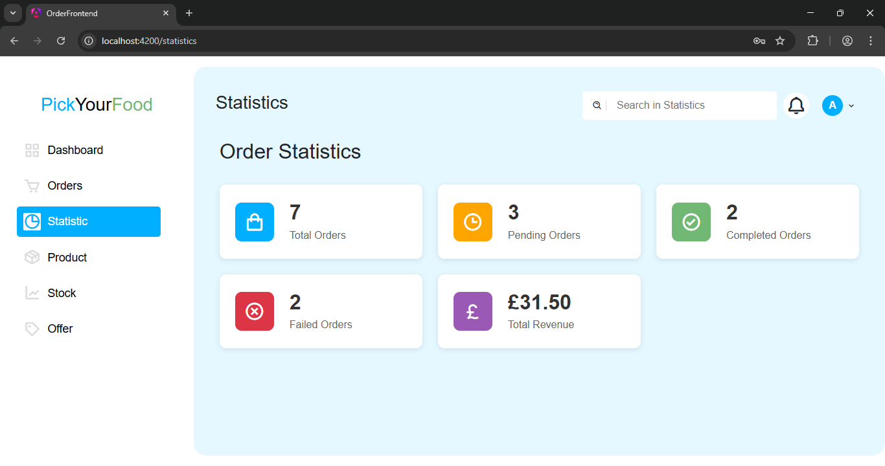
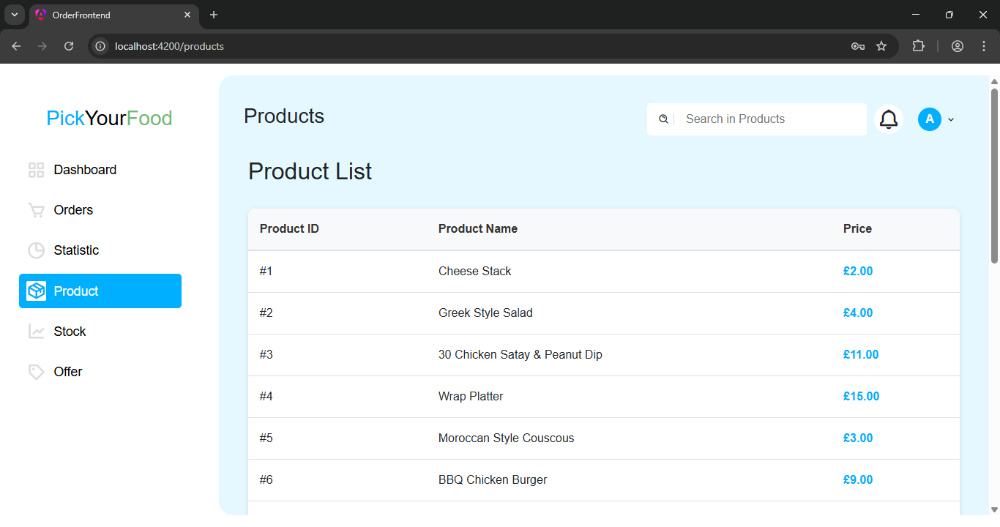
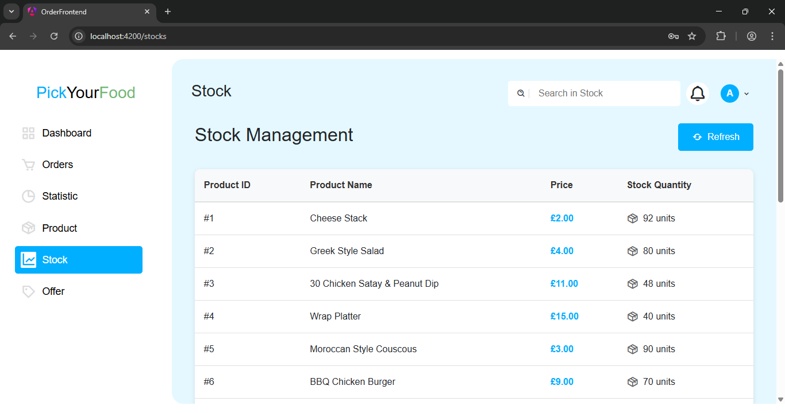
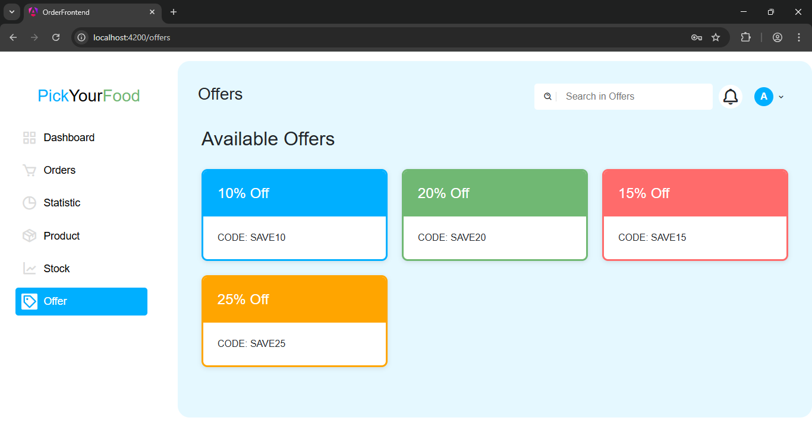

# 🍽️ Order Management System  
**Full Stack Project – Angular 20 + ASP.NET Core Web API + SQL Server**

---

## 📘 Overview
This project is a complete **Order Management System**.  
It demonstrates full integration between a modern Angular frontend, a C# ASP.NET Core Web API backend, and an SQL Server database connected via ADO.NET.

The system allows admins to manage products, create and process orders, monitor inventory, apply offers, and track business statistics such as total revenue and order statuses.

---


## ⚙️ Tech Stack

| Layer | Technology | 
|--------|-------------|
| Frontend | **Angular 20** | 
| Backend | **ASP.NET Core Web API (C#)** | 
| Database | **SQL Server** | 
| Tools | Node.js, Visual Studio 2022, SQL Server Mgmt Studio, Postman |

---

## 🧩 Application Modules

### 🔐 Login Page  
- Admin login (username: **admin**, password: **admin123**)  
- Authentication handled via **localStorage**.  
- Angular **route guards** protect all internal routes.

---

### 📊 Dashboard  
- Create new orders (**Create** operation).  
- Displays available products with price & quantity.  
- Supports **coupon application** (from Offers page).  

---

### 📦 Orders Page  
- Displays all orders with nested order items.  
- **Read (GET)**: Shows order and item details.  
- **Update (PUT / PATCH)**: Edit order details, update order status (Pending / Completed / Failed).  
- **Delete (DELETE)**: Remove orders from the system.  
- Status update is handled via the API:  
  `PATCH /api/Orders/{id}/{status}`  

---

### 📈 Statistics Page  
Displays key business metrics:
- Total Orders  
- Pending Orders  
- Completed Orders  
- Failed Orders  
- **Total Revenue** from completed orders  

---

### 🛒 Products Page  
- Fetches products from the backend via `GET /api/Products`.  
- Displays product name, price, and stock level.

---

### 🏭 Stocks Page  
- Lists product stock quantities directly from the backend.  
- Helps track low-inventory products.

---

### 🎟️ Offers Page  
- Frontend-only page showing available coupon codes.

---

### 🧭 Global Features  
- **Header search bar**: Filters data on Products, Orders, and Stocks pages.  
- **Profile dropdown**: Hover to show Logout option.  
- Consistent layout with Sidebar + Header components.
- **Sidebar**: Provide Navigation accross pages.
---

## 🗄️ Database Schema

### Tables

#### **Products**
```sql
ProductId INT IDENTITY(1,1) PRIMARY KEY,
Name NVARCHAR(100),
Price DECIMAL(10,2),
Stock INT
```

#### **Orders**
```sql
OrderId INT IDENTITY(1,1) PRIMARY KEY,
CustomerName NVARCHAR(100),
OrderDate DATETIME DEFAULT GETDATE(),
Status NVARCHAR(50) DEFAULT 'Pending',
TotalPrice DECIMAL(10,2) DEFAULT 0
```

#### **OrderItems**
```sql
OrderItemId INT IDENTITY(1,1) PRIMARY KEY,
OrderId INT FOREIGN KEY REFERENCES Orders(OrderId) ON DELETE CASCADE,
ProductId INT FOREIGN KEY REFERENCES Products(ProductId),
Quantity INT,
Price DECIMAL(10,2),
TotalPrice AS (Quantity * Price) PERSISTED
```

#### **Sample Product Data**
Contains 20 products such as *Cheese Stack, Greek Salad, Chicken Satay, Wrap Platter,* etc.

---

## 🖥️ Backend API Summary

### 🔹 `/api/Products`

| Method  | Endpoint        |
| -------- | --------------- |
| **GET**  | `/api/Products` |

---

### 🔹 `/api/Orders`

| Method     | Endpoint                    |
| ----------- | --------------------------- |
| **POST**    | `/api/Orders`               |
| **GET**     | `/api/Orders`               |
| **PUT**     | `/api/Orders/{id}`          |
| **PATCH**   | `/api/Orders/{id}/{status}` |
| **DELETE**  | `/api/Orders/{id}`          |

**Example Response (POST /api/Orders)**

```json
{
  "message": "Order created successfully",
  "orderId": 12
}
```

**Error Example**

```json
{
  "message": "Insufficient stock for product 3. Available: 5, Required: 10"
}
```

---

## ⚙️ Setup & Installation

### 🧭 Prerequisites
- Node.js  
- Angular CLI  
- Visual Studio 2022  
- SQL Server + SQL Server Management Studio  
- Postman  

---

### 🔧 Steps

1. **Clone repository**
   ```bash
   git clone https://github.com/a-rahul-krishnan/claysys-training/tree/main/day21-30/final-project
   cd day21-30/final-project
   ```

2. **Database setup**
   - Run `database.sql` in SQL Server Mgmt Studio.  
   - Verify tables: `Products`, `Orders`, `OrderItems`.

3. **Configure connection**
   Update your connection string in `appsettings.json`:
   ```json
   "ConnectionStrings": {
     "DefaultConnection": "Server=YOUR_SERVER;Database=OrderManagement;Trusted_Connection=True;"
   }
   ```

4. **Run the Web API**
   - Open project in Visual Studio → Build → Run.  
   - Test endpoints in **Postman** (`https://localhost:port/api/...`).

5. **Run the Angular Frontend**
   ```bash
   cd frontend-folder
   npm install
   ng serve -o
   ```

6. **Access App:**  
   `http://localhost:4200`

---

## 🧪 Testing
- Use Postman for CRUD verification.  
- Test UI navigation, validation, and data binding.  
- Ensure stock reduces automatically after order creation.

---

## 📸 Screenshots

### 🔹 Login Page


### 🔹 Dashboard (Create Order)


### 🔹 Orders Page


### 🔹 Statistics Page


### 🔹 Products Page


### 🔹 Stocks Page


### 🔹 Offers Page


---
